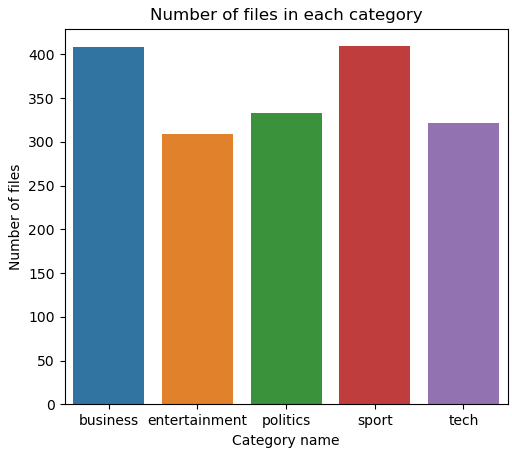
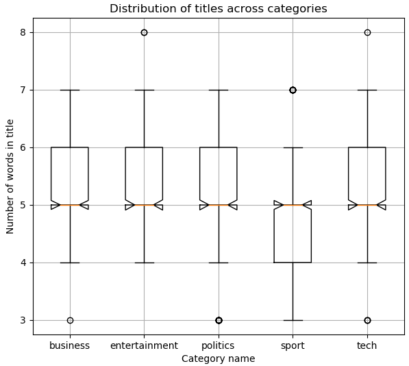
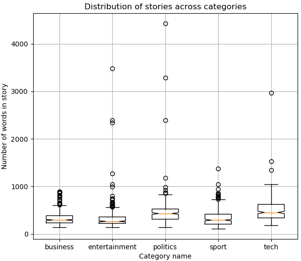

<!-- image -->
<div align="center" id="top"> 
  
  &#xa0;
</div>

<h1 align="center"> text-theme-classification </h1>
<h2 align="center"> Classifier for recognising the theme of a short text (pressnote) in one of the following five groups: business, entertainment, politics, sport and tech
 </h2>

<!-- https://shields.io/ -->
<p align="center">
  
  
  
</p>

<!-- table of contents -->
<p align="center">
  <a href="#dart-about">About</a> &#xa0; | &#xa0;
  <a href="#package-content">Content</a> &#xa0; | &#xa0;
  <a href="#checkered_flag-starting">Starting</a> &#xa0; | &#xa0;
  <a href="#eyes-implementation">Implementation</a> &#xa0; | &#xa0;
  <a href="#microscope-tests">Tests</a> &#xa0; | &#xa0;
  <a href="#memo-license">License</a> &#xa0; | &#xa0;
  <a href="#technologist-author">Author</a> &#xa0; | &#xa0;
</p>

<br>


## :dart: About ##
The project aimed to build a classifier for recognising the theme of a short text (press note) in one of the following five groups: business, entertainment, politics, sport and tech. Different methods of text representation and machine learning algorithms were considered during experiments.

## :package: Content
 * [main.py](main.py) - executable file
 * [sources](sources) - directory with source files
 * [data/learn_dataset](data/learn_dataset) - directory with learn dataset
 * [data/test_dataset](data/test_dataset) - direcory with test test_dataset
 * [models](models) - directory with ready models (classifiers)

## :checkered_flag: Starting ##
```bash
# Clone this project
$ git clone https://github.com/KamilGos/text-theme-classification

# Access
$ cd text-theme-classification

# Run the project
usage: main.py [-h] [-r] [-rt TRAIN_SET] [-rm RERUN_MODELS_DIR] [-c]
               [-ct TEXT_TO_CLASSIFY] [-cm MODELS_DIR]

optional arguments:
  -r, --rerun           Regenerate the classifiers
  -rt TRAIN_SET, --train_set TRAIN_SET
                        Directory with train set
  -rm RERUN_MODELS_DIR, --rerun_models_dir RERUN_MODELS_DIR
                        Directory to save new models
  -c, --classify        Classify text given in directory
  -ct TEXT_TO_CLASSIFY, --text_to_classify TEXT_TO_CLASSIFY
                        Directory with text to classify
  -cm MODELS_DIR, --models_dir MODELS_DIR
                        Directory with models which should be used to classify
                        new texts

# EXAMPLE OF USAGE
Classification of new text stored in "text" folder, using delivered models stored in "models" directory.
Text have to be stored in .txt files. All files should be in one folder.

$ python main.py -c -ct ./text/ -cm ./models/

Building and saving new models using train data stored in "train_text" folder and group in nested folders
by their categories (like in oryginal dataset) . Save output models in directory "modelsv2".

$ python main.py -r -rt ./train_text/ -rm ./modelsv2/
```

## :eyes: Implementation ##
<h2>Step1: Preliminary analysis</h2>

Data were delivered divided info folders. Each folder was separate text category (business, entertainment, politics, sport and tech). Each category contained several hundred files containing plain text associated with the category. Each file contained the title and the story wrote in English.

The created database has 5 columns and 1780 rows and the following structure: [category, file_id, text, title, story].

Figure a shows the histogram of rows (files) in each category. We can see that every categoryhave at least 300 texts what is enough to prepare classifiers for which reasonable results can beexpected. Figures b and c shows the distribution of words in each category separately in the title andthe story. As we can see the median of words used in titles is 5 (orange line). Sports categorytitles seems to have be shorter, maybe it is because they are often like "Bayern won" etc. Allcategories have some outliers (dots on figures), but they should not affect the results. Themedian of words in stories is between 150 and 450. Tech stories seems to be the longest, maybeit is because its explanatory type of writing.The conclusion after analysis of the data is that the data is well distributed what is very 
good information before rest of experiments. txt

| a    | b    | c    |
|---------------- | --------------- | --------------- |
|     |     |     |


In order to prepare the text for further research, all unnecessary elements were removed from it. The following changes have been made:

* all abbreviations have been replaced with full words (won’t -> will not etc.),
* all white symbols like new line ("\n") have been removed (only whitespaces left),
* all special chars has been removed,
* all "stopwords"1has been removedText pre-processing was applied for both titles and stories

Here is the example of randomly choosn title:
<center>Before: Wi-fi web reaches farmers in Peru </br> After: wi fi web reaches farmers peru</center>

After text pre-processing titles and stories were vectorized using the following methods:

* [Bag of Words (BoW)](https://en.wikipedia.org/wiki/Bag-of-words_model)
* [TFIDF](https://en.wikipedia.org/wiki/Tf%E2%80%93idf)
* [N-gram](https://en.wikipedia.org/wiki/N-gram) 

Each of this methods transform text to values vector that can be later used to fit classification models. 

-----
<h2>Step 2: Classification</h2>
During experiments the following supervised learning algorithms were used:

* [Logistic regression (LR)](https://en.wikipedia.org/wiki/Logistic_regression)
* [Naive Bayes classifier (NBC)](https://en.wikipedia.org/wiki/Naive_Bayes_classifier)
* [Support Vector Classification (SVC)](https://en.wikipedia.org/wiki/Support-vector_machine)
* [Linear Support Vector Classification (L-SVC)](https://en.wikipedia.org/wiki/Support-vector_machine)
* [Random Forest (RF)](https://en.wikipedia.org/wiki/Random_forest)


## :microscope: Tests ##
<h2> Models </h2>
All algorithms were tested for all data models (BOW, TFIDF and n-gram). Input data weredivided into test and train parts with split ratio equal to 0.8 (80% train). For every createdmodel the data test prediction and k-fold Cross-Validation (k=5) scores were calculated. Inaddition, the duration of both model building and cross-validation was calculated, because,depending on the model, these times are significantly different.

Table shows the obtained results for first attempt. Every cell contains following numbers: Test data accuracy [0,1], Model build time in seconds, 5-fold Cross-Validation result and Cross-validation execution time in seconds.

<div align="center" id="put_id"> 
  
  &#xa0;
</div>

The results obtained can be described as very good, however, the model construction times and especially cross-validation times are long. Therefore, it was decided to change the parameters of text vectoring algorithms. Now, when building the vocabulary, terms that have a document frequency strictly lower than the given threshold were ignored. This value is also called cut-off in the literature. The threshold was set to 6 for titles and 15 for stories. Table shows obtained results. As we can see changing parameters does not influence a lot on prediction and cross-valuation scores (in some cases their values increased) but execution times decreased (in some cases almost 7.5 times shorter) what is very positive result. 

<div align="center" id="put_id"> 
  
  &#xa0;
</div>


-----
<h2> New data classification using learned models</h2>
All considered methods are good for recognising the theme of a short text. The biggest differences occur in the times needed to build and validate a given model. Figure shows the output of classification for some randomly chosen files. Output is obtained using created program. 

<div align="center" id="inventor"> 
  
  
  
  &#xa0;
</div> 
 
## :memo: License ##

This project is under license from MIT.

## :technologist: Author ##

Made with :heart: by <a href="https://github.com/KamilGos" target="_blank">Kamil Goś</a>

&#xa0;

<a href="#top">Back to top</a>